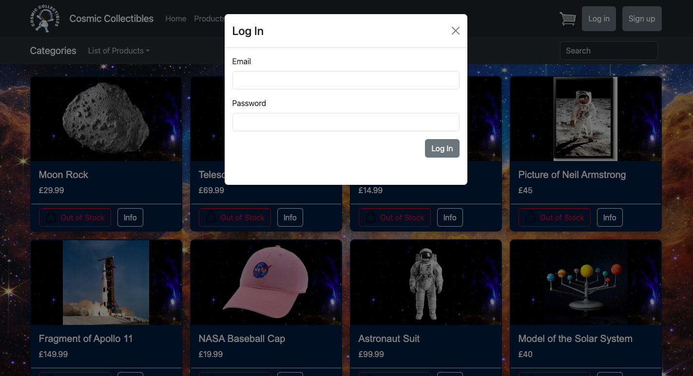

#   Project-3: CosmiCollectibles 

#### General Assembly SEI Project-3 | CosmiCollectibles | Full-stack MERN app | 7-day sprint | 3-person team

To access all of the features you can login with the following credentials:

**email:** admin@email.com **password:** admin123

<p>

</p>

## Deployment

Deployed version of our app: - https://cosmicollectibles.netlify.app/ 

## Getting started

To access the backend repository please [click here.](https://github.com/baraneldemir/backendProject3)

1. Access the source code via the 'Clone or download' button 
2. In CLI, run `npm i` on the root level to install dependencies
3. Run `npm start` to run the program in your local environment

## Overview 
This was our third project at General Assembly's Software Engineering Immersive Course. As a group we were tasked with building a full-stack application of our choice.

Inspired by Amazon and considering the amount of time we spend on Ecommerce sites trying to find something to buy to a friend, only to buy something out of frustration in the end and get disappointed, we decided since all three of us really into space products, let's make an e-commerce sites for people to buy stuff to their friends.


## Collaborators

* Alex Stocking - [@alexstocking](https://github.com/alexstocking)
* Behzad Radgizadeh - [@Behzad1983Rad](https://github.com/Behzad1983Rad)


## Brief:
☐ A **working** full-stack, single-page application hosted on Heroku.

☐ Incorporate the technologies of the **MERN-stack**:

- MongoDB/Mongoose
- Express
- React
- Node

☐ **Have a well-styled interactive front-end**.

☐ Communicates with the **Express** backend via AJAX.

☐ Implement token-based **authentication**.  Including the ability of a user to sign-up, log in & log out.

☐ Implement **authorization** by restricting CUD data functionality to authenticated users. Also, navigation should respond to the login status of the user.

☐ **Have a well-scoped feature-set**. Full-CRUD data operations are not required if one or more other features are included, for example:
	
- Consume data from a third-party API.
- Implement additional functionality if the user is an admin.
- Implementation of a highly dynamic UI or data visualization.
- Other, instructor approved, complexity/features.


## Technologies used:
* MongoDB
* Express.js
* Node.js
* JavaScript
* React.js
* HTML
* CSS
* Axios
* GitHub
* bcrypt
* google-auth-library
* mongoose
* react-bootstrap
* cdbreact
* jsonwebtoken
* jwt-decode
* react-datepicker
* react-icons
* react-router-dom


## Planning
Our group worked well from the get-go, we each had strengths that complement one another. We first planned all the features we wanted CosmiCollectibles to have, decided on which were stretch goals and which were must-haves. We then tackled the backend and only once we were all finished with our backend tasks, we moved on to the frontend. We made the decision to mainly stick to the same features and work on similar tasks on both the backend and the frontend. For example, I handled searchbar in the backend and then worked on the login and signup components in the frontend. Having a Escalidraw to keep things organised also worked very well for us. 


###### Our Excalidraw:

<hr>

#### Work Split
We divided up the features vertically. We chose our areas before we started with the backend and continued with the same ones throughout the project. Alex handled backend related functionalities. Behzad worked on payment system in the frontend and cart functionalities. We were then responsible for creating the model and related controllers for our selected functionalities. 

Because I was working on user related functionalities; authentication, home page and register/login components as well as product display, search bar and categories of products fell under my responsibilities. All three of us really enjoyed this vertical approach as it gave us a real sense of ownership.

## Process

We started every day with a mini group standup, stayed on Zoom for the rest of the day to help each other when needed and took breaks at the same time together to have a synced rhythm. At the end of each day we merged our Git branches, setting and assigning tasks for the next day. These little practices helped us stay on top of who was doing what and created an environment where we were autonomous enough to work on our own and still collaborated as a one unit team. 

We started with creating the schemas for user, cart and product

###### UserSchema
```javascript
const userSchema = new Schema({
    name: {type: String, required: true},
    email: {
        type: String,
        unique: true,
        trim: true,
        lowercase: true,
        required: true
    },
    password:{
        type: String, 
        trim: true,
        minLength: 3,
        required: true
    },
    admin: Boolean, 
}, {
    timestamps: true,
    toJSON: {
        transform: function(doc, ret) {
            delete ret.password
            return ret
        }
    }
})
```

###### ProductSchema
```javascript
const productSchema = new mongoose.Schema({
    name: String,
    description: String,
    price: Number,
    stock: Number,
    image: String,
    category: String
})
```

###### CartSchema
```javascript
const cartSchema = new mongoose.Schema({ 
    products: [{
        productId: {
            type: mongoose.Schema.Types.ObjectId,
            ref: "Product"
        },
        quantity: Number
    }],
    userId: {
        type: mongoose.Schema.Types.ObjectId,
        ref: "User"
    }
})
```

We had some trouble adjusting to working with Github as collaborators, with the pull requests and different branches, but eventually got the hang of it. 

Before moving on to the frontend, we wanted to make sure everything was working as we planned in the backend. We divided up the tasks and tested regularly after merging our branches together. 

I have created the search function in backend.

###### Search Function
```javascript
app.get('/products/search', async (req, res) => {
    const { query } = req.query
    console.log(query)
    try {
        const regex = new RegExp(query, 'i')
        const foundProducts = await Product.find({ $or: [{ name: regex }, { description: regex }] })
        console.log(foundProducts)
        res.json(foundProducts)
    } catch (error) {
        console.error(error)
        res.sendStatus(500)
    }
});
```

While creating the schemas every user had to be asssigned to a cart. So while usears are creating an account they are also creating a cart. This way every product will be shown only in user's cart.

###### GET method of products.
```javascript
app.get('/products', async (req, res) => {
    try {
        const allProducts = await Product.find({})
        res.json(allProducts)
    } catch(e) {
        console.error(e)
    }
})
```
###### POST method of products.
```javascript
app.post('/products/new', (req, res) => {
    const product = req.body
    const newProduct = new Product({
        name: product.name,
        description: product.description,
        price: product.price,
        stock: product.stock,
        image: product.image,
        category: product.category
    })
    newProduct.save()
    .then(() => {
        console.log("Product Saved")
        res.sendStatus(200)
    })
    .catch(e => console.error(e))
})
```

###### get method of cart.
```javascript
app.get('/cart', async (req, res) => {
    const userId = req.query.userId
  try {
      const cart = await Cart.findOne({ userId }).populate('products.productId'); 
      console.log(cart)
      res.json(cart);
  } catch (error) {
      console.error(error);
      res.sendStatus(500);
  }
});
```

###### POST method of cart.
```javascript
app.post('/cart/add', async (req, res) => {
  try {
      const { productId, quantity, userId } = req.body;
      // Check if the user already has a cart or create one
      let cart = await Cart.findOne({ userId });
      if (!cart) {
          cart = await Cart.create({ userId , products: [] });
      }
      // Check if the product is already in the cart
      const existingProductIndex = cart.products.findIndex(p => String(p.productId) === String(productId));
      if (existingProductIndex !== -1) {
          cart.products[existingProductIndex].quantity += quantity;
      } else {
          cart.products.push({ productId, quantity });
      }
      await cart.save();
      res.sendStatus(200);
  } catch (error) {
      console.error(error);
      res.sendStatus(500);
  }
});
```

Now every user have their own carts. We then moved on to showing in a basic display on frontend.
Firstly I have created a navbar with all of the expected functionalities of our app. Then I have created the homepage where we display only a number of products that keep changes with a slide on the background. I have then added the login and signup buttons in the the navigation bar where when you click it pops up the forms for you to sign in.




I have then created the product page where we display product cards by fetching from backend.

###### getting products from backend.
```javascript
  function getProducts() {
        axios.get(`${process.env.REACT_APP_BACKEND_URL}/products`)
        .then(response => {
            setProducts(response.data)
        })
        .catch(error => console.error("Error fetching products", error))
    }
```
After that to display them in shoppin cart we have created button and created this function to display them in shopping cart.

###### Updating shopping cart.
```javascript
function addToCart(productId, quantity, userId) {
        axios.post(`${process.env.REACT_APP_BACKEND_URL}/cart/add`, {
            productId: productId,
            quantity: quantity,
            userId: userId
        })
        .then(response => {
          
            setCart(response.data)
             
        })
        .catch(error => console.error("Error adding product to cart", error))
    }
```
Then we have added the editing the number of items in cart and deleting items in shopping cart.
###### Updating shopping cart.
```javascript
function updateProductStock(productId, stock, setStock) {
        axios.put(`${process.env.REACT_APP_BACKEND_URL}/products/${productId}`, {
            stock: stock
        })
            .then(response => {
                console.log('Product stock updated:', response.data);
                setStock(stock)
                setIsUpdated(true)
            })
            .catch(error => console.error('Error updating product stock:', error));
    }

    function deleteProduct(productId, userId) {
      
        axios
          .delete(`${process.env.REACT_APP_BACKEND_URL}/cart/remove/${productId}?userId=${userId}`)
          .then(() => {
            // setProducts(products.filter((product) => product._id !== productId));
            setCart()
            setIsUpdated(true)
            // getProducts();
            
          })
          .catch((error) => console.error("Error deleting product:", error));
      }

```

With all these, we had a fully functioning CRUD application. where users were able to chose something and add to their shopping cart and the stocks would decrease on the main site. We then moved on to features which were nice to have such as I have created a pop up when there is no stock available or add to cart pop up when there is stock available. Also with the categories section i have created in the schema users are able to search things by categories and also search them from the search bar.


## Challenges

It was a real challange to adapt with people and having collaborators. Especially at the beginning it was hard to manage all the pull push and merge requests. But we get along with it really quickly. I think as for me the biggest challange was relating the carts and users where each product would decrease from the stock and show up in someone's cart. Considering how much time we had it was really challenging to build this kind of a project in a few days. Time made it harder to develop everything we were aiming for.

## Wins
I thing the biggest win of mine from this project was to see how capable we were to work in collaborative. We made a great team, everyone was able to get along. We were very organised. We kept a routine of checking GitHub and the pull requests 2 to 3 times a day to prevent conflicts.

Another win for me was to get used to authentication and play around credentials. Which was really frustrating to get into for me before this project. 

## Key Learnings
As I said before but a really important and one of the biggest takeaways I have from this project is how important communication and collaboration is when working in a team. We worked really well together and I believe it made the entire week so much more enjoyable. 

We always knew what everyone was doing and although we worked solo most of the time, we checked in with each other regularly and made sure we spent most of the day on Zoom to create a collaborative environment. This helped us when we had problems, we would ask for help a lot sooner. We would start in the morning with a mini standup and finish every day with setting up tasks for everyone. 

## Future Features

If we had more time on this project we would add:
- Comments! If i had the time I would love to add comments to product pages, which i think it is really important in a e-commerce website
- Ability to rate products
- Maybe profile page for the user with the favourite products.


